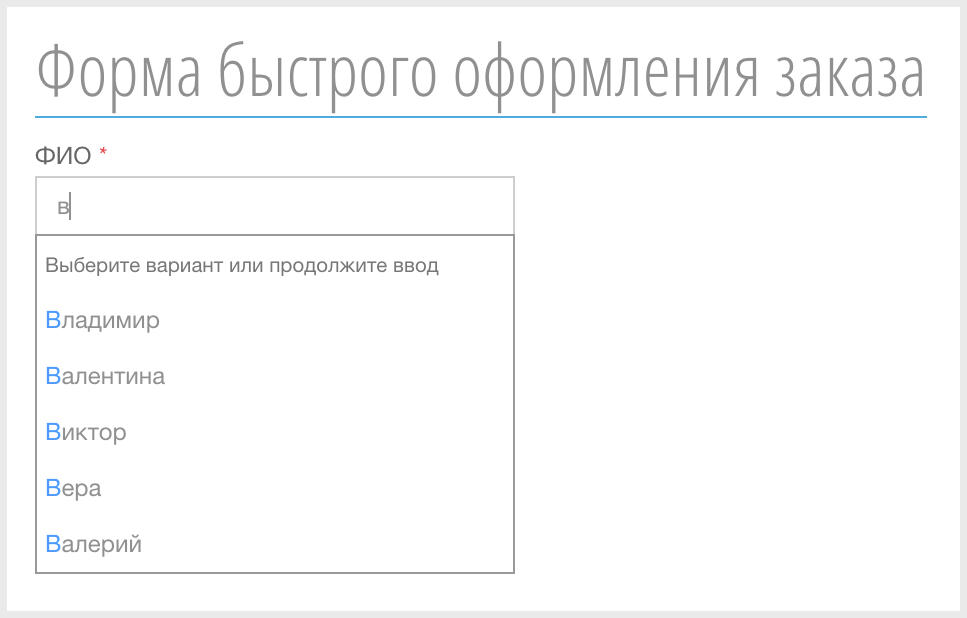
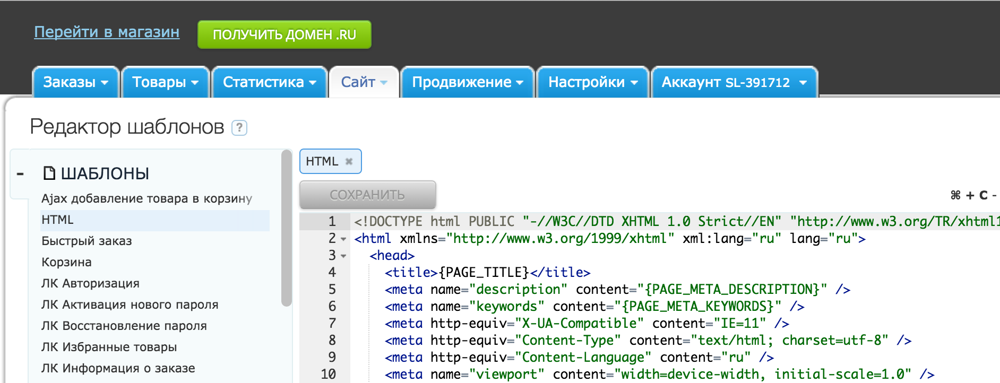
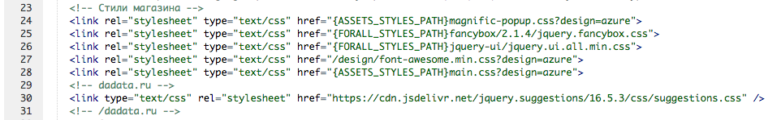
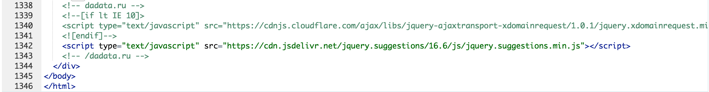
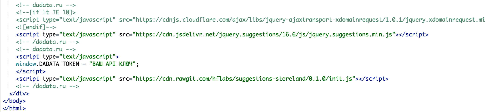

# Подсказки DaData.ru для Storeland

Подсказки DaData.ru для Storeland — удобный способ ввести ФИО, адрес и e-mail на форме заказа и в профиле клиента.



Инструкция по подключению подсказок DaData.ru к платформе [StoreLand](http://storeland.ru/):

1. Открыть редактор шаблонов: `http://код_магазина.storeland.ru/admin/site_templates`.

2. Выбрать подраздел Шаблоны > HTML.


3. Добавить ссылку на css-файл Подсказок в блок «Стили магазина»:
```
<!-- dadata.ru -->
<link href="https://cdn.jsdelivr.net/jquery.suggestions/16.6/css/suggestions.css" type="text/css" rel="stylesheet" />
<!-- /dadata.ru -->
```

4. Добавить ссылку на js-файл Подсказок в конец шаблона:
```
<!-- dadata.ru -->
<!--[if lt IE 10]>
<script type="text/javascript" src="https://cdnjs.cloudflare.com/ajax/libs/jquery-ajaxtransport-xdomainrequest/1.0.1/jquery.xdomainrequest.min.js"></script>
<![endif]-->
<script type="text/javascript" src="https://cdn.jsdelivr.net/jquery.suggestions/16.6/js/jquery.suggestions.min.js"></script>
<!-- /dadata.ru -->
```

5. Добавить код инициализации подсказок в конец шаблона (под результат из шага 4):
```
<!-- dadata.ru -->
<script type="text/javascript">
  window.DADATA_TOKEN = "ВАШ_API_КЛЮЧ";
</script>
<script type="text/javascript" src="https://cdn.rawgit.com/hflabs/suggestions-storeland/0.1.0/init.js"></script>
<!-- /dadata.ru -->
```

Вместо `ВАШ_API_КЛЮЧ` укажите ваш API-ключ на DaData.ru. Чтобы получить ключ,  [зарегистрируйтесь](https://dadata.ru/#registration_popup) и сгенерируйте ключ в [личном кабинете](https://dadata.ru/profile/#info).

После регистрации подтвердите e-mail адрес, иначе подсказки не будут работать.
